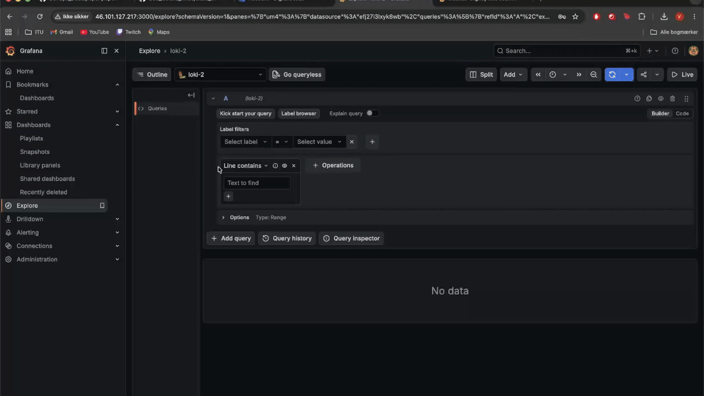
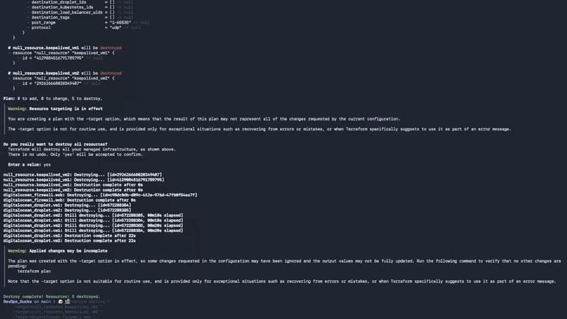
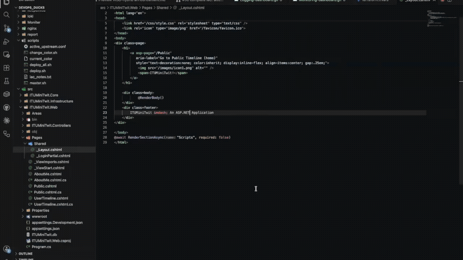
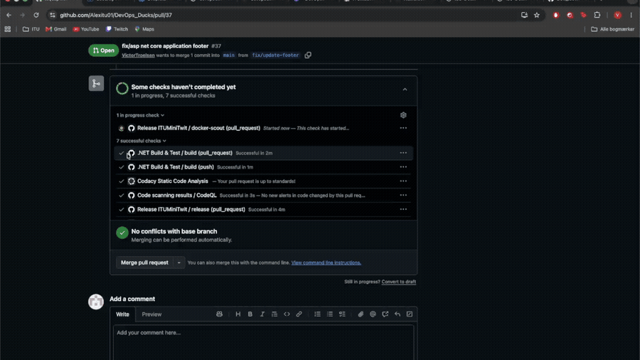
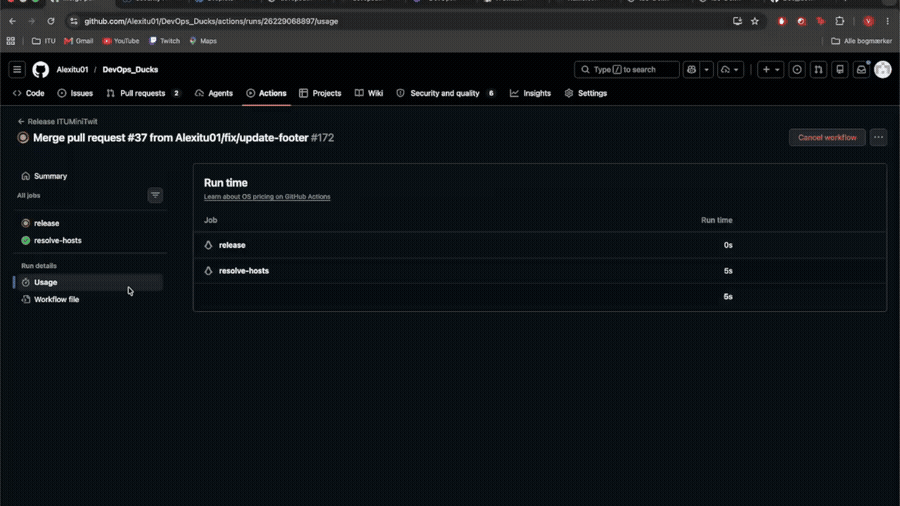
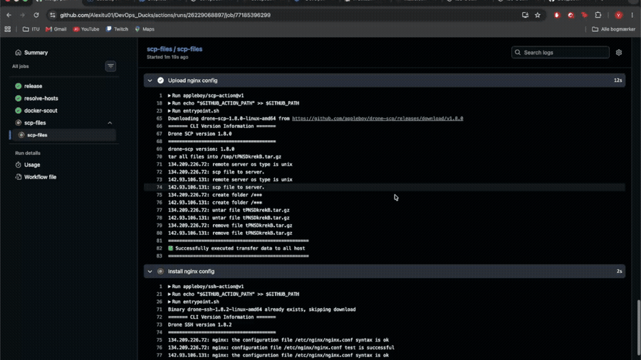

## About the project
This project was used in the course DevOps Software Maintenance and Development. 

## How to run the project
Start by cloning the repo to your local machine.
```bash
git clone https://github.com/Alexitu01/DevOps_Ducks.git
```
In order to run the webapplication on your local machine do the following:
```bash
cd src/ITUMiniTwit.Web
dotnet run
```
To deploy the project to production for the first time do the following:
```bash
```

## Contributing to project in production
To contribute to the project, start by creating a branch:
```bash
git checkout -b <branch_name>
```
Once done with adding the new feature, fixing a bug etc., push the local branch to the remote.
```bash
git push -u origin <branch_name>
```
When the branch has been pushed to GitHub, create a pull request, wait for the workflows to run the code through mandatory checks, wait for review and approvement from code reviwers and lastly merge the branch to main.

## Tech stack
- C#
- ASP .NET EF Core
- ASP .NET Identity
- ASP .NET Razor Pages
- Grafana alloy
- Grafana loki
- Prometheus
- Nginx
- Keepalived
- Docker & Docker Compose
- Terraform

## Demos

### Monitoring Dashboard


### Logging Dashboard


### Infrastructure as Code


### CI/CD Pipeline
#### Part 1

#### Part 2

#### Part 3

#### Part 4


## Legacy branch
The branch `ITUMiniTwit.Legacy` contains the original Python-based MiniTwit implementation used earlier in the course.  
It is kept for reference purposes only and is **not under active development**.
