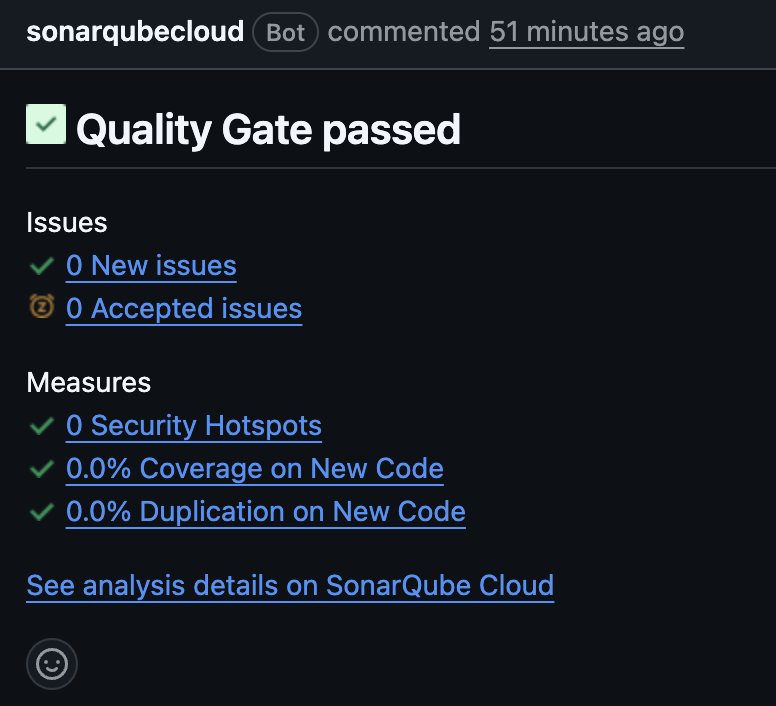
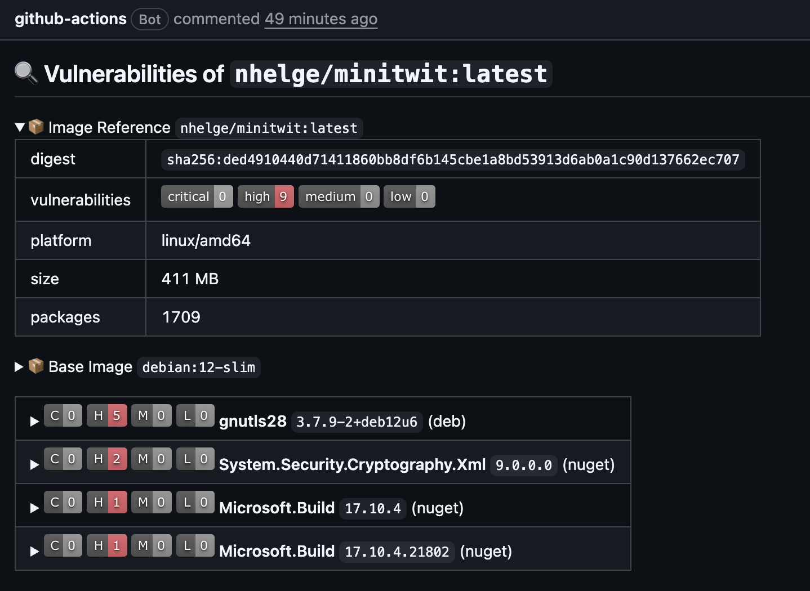
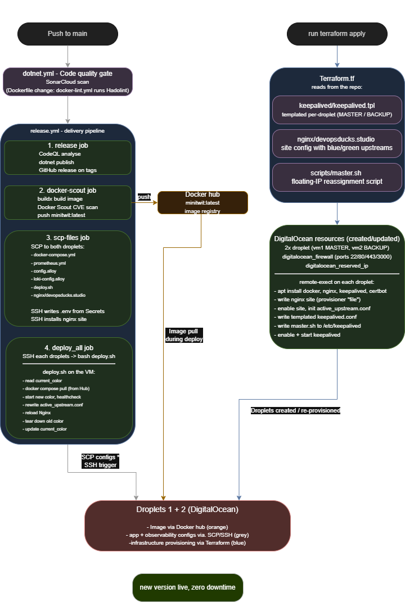

# DevOps Ducks - Group 1
## 1. System's Perspective
*Authors: [Nick Kjær Christoffersen]*

This chapter describes the structure of our ITU-MiniTwit system, its main dependencies, and its current state. The source code, report source, Docker/Terraform files, and CI/CD workflows are kept in our project repository, while the final PDF is built in the `report/build` directory as required.

Key artifacts for this chapter include: the [.NET solution](../ITUMiniTwit.Razor.sln), the [Docker Compose setup](../docker-compose.yml), the [Terraform configuration](../Terraform.tf), and the [GitHub Actions workflows](../.github/workflows).

### 1.1 System Structure
*Authors: [Nick Kjær Christoffersen, Alexander Hvalsøe Holst, Victor Hvid Troelsen, Mathias Bardram Johnbeck]*

- Design and architecture

#### 1.1.a Application

ITUMiniTwit is an ASP.NET Core web application based on the earlier 'Chirp' project. The application supports both browser-based interaction and API-based simulator traffic. Razor Pages are used for the user-facing web interface, while ASP.NET Core controllers expose API endpoints such as `/msgs`, `/fllws`, `/register`, and `/latest`.

The application is structured into separate projects for web, infrastructure, and core domain logic. The web project contains the Razor Pages, Identity pages, controllers, and application startup configuration. The infrastructure project contains the Entity Framework Core database context, repositories, services, and monitoring codes. The core project contains the main domain models, such as `Author`, `Cheep`, and `CheepLike`. 

Persistence is handled with Entity Framework Core. Development uses an empty SQLite database, while production uses a shared external MySQL database through a common connection string. Authentication is handled with ASP.Net Core Identity, where `Author` extends the standard Identity user model. Identity is used for registration, login, logout, and user-specific functionality such as posting cheeps, following other users, and viewing personal timelines. 

The application is containerzied and deployed as multiple identical containers. It also exposes Promethus metrics, including HTTP request metrics and a custom login metric for successful and failed login attempts. 

#### 1.1.b Infrastructure

The production system runs on two Digital Ocean[^1] droplets (Virtual Machines). A reserved IP gives the system a single entry point, while Nginx forwards incoming traffic to the active application containers. 

Docker Compose manages the deployed services, including the application containers and the monitoring/logging stack. The application containers are based on the same Docker image and connect to the same external MySQL database. 

The infrastructure uses a blue-green deployment setup with two blue and two green containers. This allows a new version to be started and checked before traffic is switched. Keepalived supports failover between the two droplets if one becomes unavailable.

The observability stack consists of Prometheus, Grafana, Loki, and Alloy. 

### 1.2 Dependencies
*Authors: [Nick Kjær Christoffersen, Alexander Hvalsøe Holst, Nanna Helge]*

The system depends on .NET 9, ASP.NET Core Razor Pages, ASP.NET Core Identity, and Entity Framework Core for the main application. Digital Ocean droplet VM's are used. for deploying the application. SQLite is used for local development, while MySQL from Aiven[^2] is used in production. 

Docker and Docker Compose are used to build and run the application and supporting services. GitHub Actions is used for build, test, quality checks, release, Docker image publishing, and deployment. Terraform is used for provisioning the Digital Ocean infrastructure. Nginx is used as reverse proxy and load balancer, while Keepalived supports failover between droplets. 

For monitoring and logging, the system uses Prometheus, Grafana, Loki, and Alloy. SonarCloud, CodeQL, Hadolint, and Docker Scout are used for code quality, security checks, Dockerfile linting, and container vulnerability scanning. 
[^1]: https://www.digitalocean.com/
[^2]: https://aiven.io/

### 1.3 Current System State 
*Authors: [Nick Kjær Christoffersen, Alexander Hvalsøe Holst, Mathias Bardram Johnbeck]*
#### 1.3.a Overview

The current system is in a working and deployable state. Through GitHub Actions, the application can be built, tested, containerized, pushed to Docker Hub, and deployed to the production droplets. The blue-green setup makes deployment safer because a new version can be started before traffic is moved to it. 

The system is supported by quality and security tools such as SonarCloud, CodeQL, Hadolint, and Docker Scout. These helped find issues in the code, workflows, Dockerfile, and Docker image. Some smaller code quality issues still remain, and the GUI sometimes has latency or stability issues when communicating with the web server.

A caveat to the CI-CD pipeline is that upon infrastructure changes, the only persistant data, is the base database itself, prometheus, loki and grafana volumes are lost, thereby potentially loosing long term logging and montering data that might've been useful, as well as deleting existing Grafana dashboards. 

#### 1.3.b Code Quality and Security

SonarCloud scans the application for security, reliability, maintainability, duplicated code, and test coverage. It was used throughout the project to identify and address issues introduced with new features and changes. The screenshot below shows an example of the quality gate passing on a pull request with no new issues or security hotspots introduced.

CodeQL is used in the release workflow to find security issues, especially in the application and CI/CD setup. Hadolint checks the Dockerfile for best-practice problems. Docker Scout scans the built Docker image for known vulnerabilities, especially high and critical ones. In our workflow, Docker Scout reports issues but does not block deployment. The final scan reported 0 critical and 9 high vulnerabilities, all originating from the base image (debian:12-slim) and dependencies rather than application code.

Codacy, Much like sonarcloud scans the application for risks and bad code; for better coverage.

#### 1.3.c Tests

The project contains unit, integration, and Playwright tests. Unit tests check smaller parts of the system, such as cheep length limits, paignation, posting cheeps, and follow/unfollow behavior. Integration tests check repository and database behavior. 

Playwright tests check browser flows such as loading the homepage and using login/register links, but they are not run in the main GitHub Actions workflow. 

## 2. Process' Perspective
*Authors: [Nick Kjær Christoffersen]*

This chapter describes how changes move from idea to running system. It covers the CI/CD pipeline, monitoring, logging, security, and availability setup used for ITUMiniTwit.

Key artifacts for this chapter include: the [GitHub Actions workflows](../.github/workflows), the [Dockerfile](../Docker/Web/Dockerfile), the [Docker Compose setup](../docker-compose.yml), the [Terraform configuration](../Terraform.tf), the [deployment script](../scripts/deploy.sh), the [Nginx configuration](../nginx/devopsducks.studio), the [Prometheus configuration](../Moniter/Prometheus/prometheus.yml), and the [Alloy configuration](../alloy/config.alloy).

### 2.1 Process Stages
*Authors: [Mathias Bardram Johnbeck]*

- Illustration of individual steps in CI/CD pipeline

#### Github actions
All application changes flow through GitHub Actions. A push or pull request triggers dotnet.yml, which restores dependencies, builds the solution, runs the unit and integration test suites, and performs a SonarCloud scan for code quality;   
`docker-lint.yml` separately runs Hadolint against the `Dockerfile` when Docker-related files change.    

A push to main then triggers release.yml, the delivery pipeline, which runs four sequential jobs:    
- the `release` job performs CodeQL security analysis and publishes platform-specific binaries (creating a GitHub Release on tags);   
- the `docker-scout` job builds the container image, scans it for critical and high CVEs with Docker Scout, and pushes it to Docker Hub;   
- the `scp-files.yml` copies the runtime configuration onto both droplets and writes the `.env` from GitHub Secrets;   
- the deploy_all job connects to each droplet over SSH and runs `deploy.sh`

#### Docker Compose
The image produced by the pipeline does not run alone.   `docker-compose.yml` copied to each droplet by the pipeline, describes how the system is wired together:   
the four web-server containers (two replicas each of the blue and green deployment colours), and the observability services (Prometheus, Loki, Grafana, and Alloy), all sharing a single Docker bridge network. When `deploy.sh` runs on a droplet, it uses Docker Compose to pull the new image from Docker Hub and start the inactive colour's containers.   The database is deliberately excluded from Docker Compose and runs as a managed MySql instance on a third party (Aiven).

### Terraform
Terraform provisions the infrastructure it runs on.   `Terraform.tf` defines the two droplets, the firewall rules (opening only ports 22, 80, 443, and 3000), and the reserved IP, and uses provisioners to install Docker, Nginx, and Keepalived on each droplet, copy the Nginx site configuration into place, and render the Keepalived configuration from a per-droplet template (`keepalived.tpl`). `terraform apply` is executed manually by an operator when the infrastructure itself changes, which is rare, whereas the release pipeline runs on every push to main. Separating the two between infrastructure changes and application changes.

### 2.2 Monitoring
*Authors: [Alexander Hvalsøe Holst, Nanna Helge]*

As mentioned, our monitoring was mainly done with Prometheus and Grafana via the `prometheus.yml` file, Prometheus collected metrics from both blue and green containers, while Grafana's UI made it visually structured.
Prometheus was used to mainly monitor the "performance" of the different containers. Latency was monitored to make sure that the response time of the application was acceptable - specifically with new deployments.
The total memory use of dotnet was monitored, to detect unusual resource consumption, and verify that the application was stable for new deployments (by comparing them to the old deployments).
The number of requests were also monitored to see which endpoints were visited often, and what kind of responses those requests would get. (Although this was not relied upon in this course, - since the simulator used API endpoints - in a real-life scenario this sort of monitoring would be important.) 

### 2.3 Logging
*Authors: [Alexander Hvalsøe Holst, Mathias Bardram Johnbeck]*

With the `alloy.config` file Alloy scraped logs from the containers and passed them to Loki. Loki collected the logs and by using Grafana, the data also became visually structured.
We used Loki to differentiate between simulator 404 responses and bot 404 responses, making it possible to debug and act upon 'real' failed requests to the webserver API. Similarly to monitering we used Grafana's dashboards to visualize our logs: by job, content and volume.  

### 2.4 Security
*Authors: [Nick Kjær Christoffersen, Victor Hvid Troelsen]*

Security was handled in several parts of the system. The DigitalOcean firewall only opens the ports needed for SSH, HTTP, HTTPS, and Grafana. The application containers are mapped to host ports internally, but these ports are not opened in the firewall. Incoming traffic instead goes through Nginx.

Nginx works as a reverse proxy in front of the remote virtual machines. This gives the system one public entry point. Keepalived is used to handle failover, starting the backup virtual machine in case the primary is down.

Secrets are not stored in the source code. Database credentials, Docker Hub credentials, SSH keys, and deployment values are stored as GitHub Secrets. During deployment, the workflow writes the needed `.env` file on the droplets.

TLS is fully automated through Terraform. Certbot and the necessary plugins are installed as part of VM provisioning, and a non-interactive certbot run obtains and installs a Let's Encrypt certificate for the domain. Nginx is configured to serve traffic over HTTPS and redirect all HTTP requests to HTTPS. Port 443 is opened in the DigitalOcean firewall to allow this traffic.

Security checks are included in the pipeline. SonarCloud, CodeQL, and Codacy check both code quality and security issues, while Docker Scout scans the Docker image for known vulnerabilities.

### 2.5 Availability
*Authors: [Mathias Bardram Johnbeck]*  
Across the two droplets, we use active/passive failover rather than load balancing. 
A Digital Ocean reserved (floating) IP routes all external traffic to one droplet at a time. 
Both droplets run an identical stack, but only the one currently holding the reserved IP receives traffic; the other is a hot standby.  
Keepalived daemons on both droplets exchange VRRP heartbeats over the private network and monitor local Nginx health. If the primary's Nginx fails or the primary droplet becomes unreachable, the standby promotes itself to MASTER and runs `master.sh`, which calls the Digital Ocean API to reassign the reserved IP to itself.  

Within each droplet, Nginx acts as a reverse proxy and load balancer. The active deployment colour runs as two identical container replicas (e.g. `blueserver1` and `blueserver2`), and Nginx distributes incoming requests across them in round-robin fashion via an upstream block. If one replica becomes unresponsive, Nginx detects the failed upstream and routes solely to the healthy one until it recovers

## Reflection Perspective
The biggest issues and how they were solved:
1. evolution and refactoring
2. operation, and
3. maintenance
Link back to commit messages, issues, tickets etc.
Also reflect and describe what was the "DevOps" style of your work. For example, what did you do differently to previous development projects and how did it work?

### Database issues 
*Authors: [Alexander Hvalsøe Holst, Victor Hvid Troelsen]*

When the application was hosted, the database got wiped twice within the first week. It was thought to be an issue within the MySql image, and the database was simply recovered with old backup data. The second time it happened, it was discovered that it was hacked, which made us aware of the vulnerabilities with exposing the database port. In the `docker-compose.yml` file, we removed the part that hosted the database, and the issue did not reoccur ( 
0e005dd ).

### VM Corruption
*Authors: [Alexander Hvalsøe Holst]*

In the middle of the course the main VM got 'corrupted'. The causes were (and are) unkown even with extensive debugging. The first time we tried restarting the VM, and even sending a 'ticket' to Digital Ocean. After a week of trying to recover the specific droplet, it was decided that 'just' creating a new droplet was the best solutiom.
This made the team more focused on simply getting the system back up, rather than trying to find the "right" procedures.

### Spillover
*Authors: [Alexander Hvalsøe Holst, Mathias Bardram Johnbeck]*

In this course there were some issues with implementation, meaning; new functionality requirements were added, while older requirements were still not fully implemented. We mitigated this with a focus of efficient division of labour, in an attempt to reduce bottlenecks and iddling. As such some features took a backseat even if they technically should have been implemented first.

### DevOps Reflection

*Authors: [Victor Hvid Troelsen]*
  
In previous projects, the team had no monitoring, logging, or automated deployment. Problems were discovered only when something visibly broke, and code reached production manually.

The most noticeable shift was the feedback loop. GitHub Actions delivered test failures and security scan results within minutes of a push. More unexpectedly, Prometheus, Grafana, and Loki surfaced problems the team would not have
thought to look for — 404 patterns distinguishing real errors from simulator noise, or memory diverging between blue and green containers. Being notified about these things rather than having to look for them was a qualitatively
different experience from past projects.
  
Infrastructure as code changed how the team thought about failure. When the primary VM became corrupted mid-course, it had to be rebuilt manually. An experience that underlined exactly why reproducible infrastructure matters.

The main friction was pipeline overhead. For small fixes, waiting for the full CI run felt slow compared to deploying directly.

Overall, the biggest practical difference was not any single tool, but the combination of automation and observability: broken builds, failing containers, and unusual traffic patterns became visible events rather than silent failures.

## Use of Generative AI
Generative AI services such as OpenAI and Anthropic's Claude, were used mainly for issues that weren't well documented, for debugging, and for help with explaining tool documentation.

### For niche issues (undocumented) 
*Authors: [Alexander Hvalsøe Holst]*

When the database got wiped, as mentioned before, AI was used to pinpoint what aspect of the software allowed this. It identified the issue as an exposed port in the `docker-compose.yml` file, and we removed the exposed port.

In the setup of the `alloy.config` file we used generative AI to 'hint' as to what aspect of the code was wrong, since alloy wasn't scraping the correct logs. After learning the main issue, we used documentation to find the correct setup for scraping the logs we needed.

### CLI Commands for debugging 
*Authors: [Alexander Hvalsøe Holst]*

When setting up Nginx and Keepalived, we used generative AI to give debugging CLI commands, to specifically look at logs in Nginx, Keepalived and Docker. This helped us identify bugs more efficiently.

