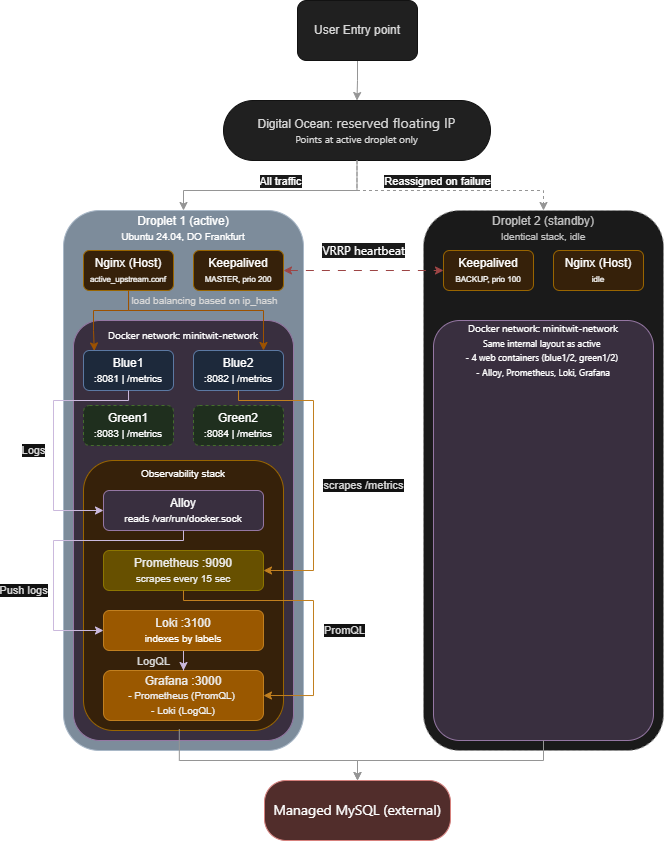

# DevOpsDucks - Group 1

## Introduction [EMPTY]

## 1. System's Perspective

Description and illustration of:
1. Design and architecture of your ITU-MiniTwit systems.
2. All dependencies of your ITU-MiniTwit systems on all levels of abstraction and development stages. That is, list and briefly describe all technologies and tools you applied and depend on.
3. Describe the current state of your systems, for example using results of static analysis and quality assessments
\
This chapter outlines the system structure of our MiniTwit application and its current dependencies. The current system state will be illustrated and explained in detail. 

### 1.1 System Structure [ALMOST_WRITTEN] + [Needs-Diagram]
- Design and architecture

#### 1.1.a Application [HALF-WRITTEN] 
MiniTwit is an ASP.NET Core web application based on the earlier 'Chirp' project: It extendeds the support for both browser-based interaction and API-based simulator traffic. Razor Pages handle the user-facing web interface, while controllers expose API endpoints used to handle simulator traffic.

For persistence, the application uses Entity Framework Core with a MySQL database hosted on Aiven instead of the earlier used SQLite setup from Chirp. All of the deployed application containers share the same database through a common connection string. This allows multiple running instances of the application to serve requests while persisting data in the same database.

The application is wrapped within a container and joined with monitoring and logging systems through a shared network.

- Possibly Talk about LoginMetrics + Add other Metrics.
[Needs info from team]

#### 1.1.b Infrastructure [WRITTEN] [Needs-Diagram]
The production system is hosted on two DigitalOcean droplets (Virtual Machines). The droplets contain the runtime environment for the application while supporting horizontal scaling and failover. A reserved IP address is used for both droplets, giving the system a single point of entry. Incoming traffic is then distributed by Nginx among the available application instances.

The deployed services are managed with Docker Compose, defining the containers that run in the runtime environment, setting up a shared network and the supporting monitoring and logging systems. The application is deployed as multiple containers, based on the same image. The applications all refer to the same MySQL database hosted on Aiven through a common connection string.

Nginx is used as a reverse proxy and load balancer, repsonsible for forwarding incomming traffic to the currently active environment and available containers while using an 'ip_hash' . Keepalived is used between the two droplets, supporting recovery of the deployed environment, if one of the droplets become unavailable.

To support safer deployment, the infrastructure uses a blue-green setup. Two blue and two green containers are defined in the docker compose file, allwoing a new version of the application to be started and verified before traffic is switched.

The infrastructure includes monitoring and logging components such as Prometheus and Grafana, and Alloy and Loki.

#### 1.1.c Dependencies [WRITTEN] + [Needs-Diagram]
##### .NET
Within the .NET library we used Entitiy Frameowkr Core as a way to read and write to the databse, while Identity was used as a way to structure the data and used for authentication.

##### Docker / Docker Compose
Docker was used for conainerising the application and Docker Compose was used to manage services and ensure a shared network.
hadolint...?
##### Github Actions
Github actions managed the pipeline of integrating and deploying the application. 

##### Grafana, Prometheus, Loki, Alloy
Grafana, Prometheus, Loki, and Alloy were used as the system’s observability stack, supporting monitoring, log collection and storage, and visualization of operational data.

##### Keepalived
Keepalived was setup as a channel of communication between droplets ensuring failover.

##### Nginx
Nginx worked like the reverse proxy and also as a Load Balancer, ensuring traffic was handled effectively.

##### SonarCloud
SonarCloud was used to quality check the system.

##### MySQL
Used as the database

### 1.2 Current System State [HALF-WRITTEN] 
- Talk about the current "condition"
#### 1.2.a Overview
The current system is in a deployable and operational state. 
Blue-green architecture supports safer deployment while lowering downtime and making rollbacks easier. SonarCloud, CodeQL and other lints helped identify vulnerabilities in the system, however minor issues and failure to uphold coding practices still remain. 
One known limitation is the latency and stability around the GUI to the web server, which still requires further refinement. 

#### 1.2.b Code Quality and Security
##### SonarCloud
SonarCloud is used to scan the application code: It scans the system for issues like, security, reliability, maintainability, hotspots and test coverage.
We used SonarCloud mainly for security reasons - to secure our system and remove vulnerabilities in the code.
Things like maintainability and code duplication were only handled if SonarCloud deemed them "high" priority, or if the scan failed because of their severity.

##### CodeQL
CodeQL mainly identified seucrity issues within the CI/CD worfklow like inside of the Github Actions. No major application-code vulnerabilities were reported by the default analysis. 

##### Hadolint
Hadolint was used for the Dockerfile for the application. It wrote warnings and errors based on how the Dockerfile was written.

##### Docker-Scout

#### 1.2.c Tests [EMPTY]
[Need Information]

## 2. Process' Perspective [EMPTY]
Clarify how code or other artifacts come from idea to running system. Include the following:
1. A complete description and illustration of stages and tools included in the CI/CD pipelines, including deployment and release of your systems.
2. How do you monitor your systems and what precisely do you monitor?
3. What do you log in your systems and how do you aggregate logs?
4. Brief description of how you security hardened your systems.
5.  How do you handle availability and scaling in your systems?

### 2.1 System Stages [EMPTY]
- Illustration of individual steps in CI/CD pipeline
*-* Github Actions
*-* Docker Compose
*-* Terraform

### 2.2 Monitoring [WRITTEN]
As mentioned, our monitoring was mainly done with Prometheus and Grafana. Via the prometheus.yml file, Prometheus collected metrics from both blue and green containers, while Grafana's UI made it visually structured.
Prometheus was used to mainly monitor the 'performance' of the different containers. Latency was monitored to make sure that the response time of the application was acceptable - specifically with new deployments.
The total memory use of dotnet was monitored, to detect unusual resource consumption, and verify that the application was stable for new deployments (by comparing them to the old deployments).
The number of requests were also monitored to see which endpoints were visited often, and what kind of responses those requests would get. (Although this was not relied upon in this course, - since the simulator used API endpoints - in a real-life scenario this sort of monitoring would be important.)

### 2.3 Logging [HALF-WRITTEN]
With the alloy.config file Alloy scraped logs from the containers and passed them to Loki. Loki collected the logs and by using Grafana, the data also became visually structured.
We used Loki to differentiate between simulator 404 responses and bot 404 responses, making it possible to debug and act upon 'real' failed requests to the webserver API.

### 2.4 Security [EMPTY]
- Closing off exposed ports
- Firewall
- Github Secrets
- HTTPS
- Reverse proxy...?

### 2.5 Availability [EMPTY]
- Multiple droplets
- Load Balancer
- Green-blue architecture

## Reflection Perspective [EMPTY]
The biggest issues and how they were solved:
1. evolution and refactoring
2. operation, and
3. maintenance
Link back to commit messages, issues, tickets etc.
Also reflect and describe what was the "DevOps" style of your work. For example, what did you do differently to previous development projects and how did it work?

### Database issues [EMPTY]

### Logging issues [EMPTY]

### VM Corruption [EMPTY]

### Spillover [EMPTY]

## Use of Generative AI [EMPTY]

### For niche issues (undocumented) [EMPTY]
* Database thieves
* Alloy config

### CLI Commands for debugging [EMPTY]
* nginx logs
* keepalived logs
* docker logs

